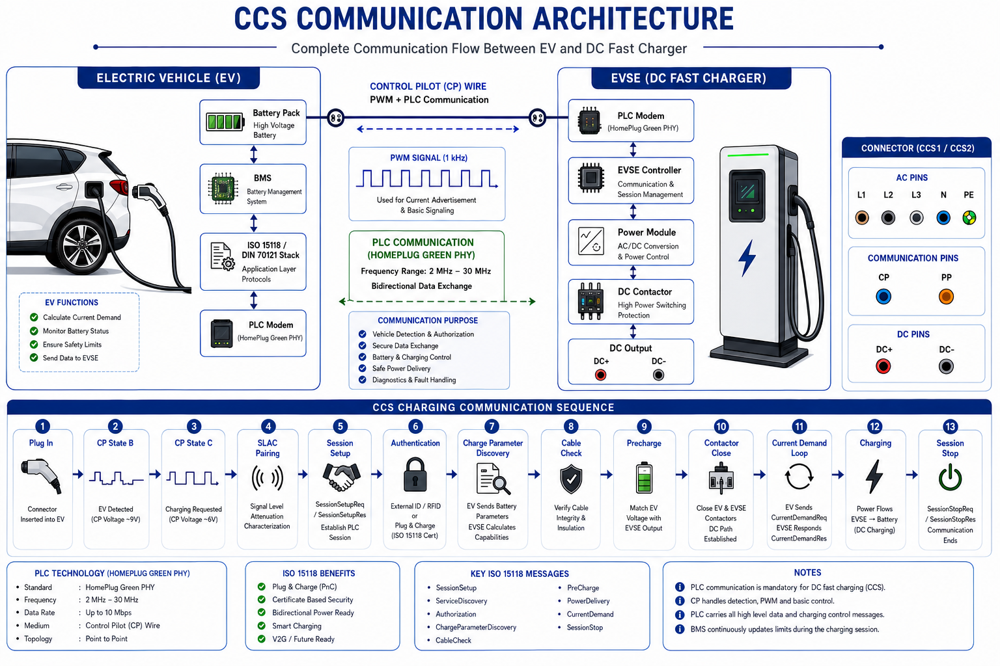

# ⚡ CCS Communication in EV Charging

> Complete Engineering Guide to CCS, IEC 61851, PLC, DIN 70121, ISO 15118, OCPP Mapping and NOC Troubleshooting.

---

## 🏗️ CCS Communication Architecture

<p align="center">
  
</p>

---

# Table of Contents

1. Introduction
2. Why CCS Exists
3. AC vs DC Charging
4. CCS Connector Anatomy
5. Control Pilot (CP)
6. Proximity Pilot (PP)
7. PWM Current Advertisement
8. PLC Communication
9. SLAC
10. DIN 70121
11. ISO 15118
12. Complete Charging Sequence
13. Precharge
14. Current Demand Loop
15. OCPP Mapping
16. NOC Troubleshooting
17. Wireshark Analysis
18. Interview Questions

---

# Introduction

CCS (Combined Charging System) is the dominant DC fast charging technology used worldwide.
Unlike AC charging, CCS requires digital communication between EV and EVSE before power transfer.

The EV and charger exchange:

- Battery Voltage
- Battery Current Limits
- SOC
- Temperature
- Charging Capability
- Safety Information

---

# Why CCS Exists

DC charging delivers power directly to the battery.

Because the charger controls voltage and current, the charger must continuously communicate with the vehicle BMS.

Without communication:

- Battery damage may occur
- Over-current may occur
- Unsafe charging conditions may develop

---

# AC vs DC Charging

| Feature | AC Charging | DC Charging |
|----------|------------|------------|
| CP | Yes | Yes |
| PP | Yes | Yes |
| PLC | No | Yes |
| ISO 15118 | Optional | Required |
| BMS Communication | Limited | Extensive |

---

# CCS Connector Anatomy

## Communication Pins

- CP (Control Pilot)
- PP (Proximity Pilot)

## Power Pins

- DC+
- DC-

## Protective Pin

- PE

---

# Control Pilot (CP)

CP is the primary signaling line defined by IEC 61851.

| State | Voltage | Meaning |
|---------|---------|---------|
| A | +12V | No EV |
| B | +9V | EV Connected |
| C | +6V | Ready To Charge |
| D | +3V | Ventilation Required |
| E | 0V | Fault |
| F | -12V | Severe Fault |

Functions:

- EV Detection
- Charging Permission
- PWM Advertisement
- Safety Monitoring

---

# Proximity Pilot (PP)

PP identifies:

- Cable capability
- Plug insertion
- Release button status

Typical cable coding:

| Resistance | Cable Rating |
|------------|-------------|
| 1500Ω | 13A |
| 680Ω | 20A |
| 220Ω | 32A |
| 100Ω | 63A |

---

# PWM Current Advertisement

Frequency:

```text
1 kHz
```

Formula:

```text
Current = Duty Cycle × 0.6
```

Examples:

| Duty Cycle | Current |
|------------|---------|
| 20% | 12A |
| 50% | 30A |
| 80% | 48A |

Purpose:

- Prevent overload
- Inform EV of available current
- Dynamic load management

---

# PLC Communication

Technology:

```text
HomePlug Green PHY
```

PLC runs over the Control Pilot conductor.

Used for:

- Session Setup
- Authentication
- Service Discovery
- Charge Parameter Discovery
- Current Demand

---

# SLAC

SLAC = Signal Level Attenuation Characterization

Purpose:

Pair the correct EV with the correct charger.

Without SLAC:

- Nearby chargers may respond
- Communication ambiguity occurs

---

# DIN 70121

Legacy CCS DC charging protocol.

Provides:

- Session Setup
- Charging Control
- Current Demand Messaging

No Plug & Charge support.

---

# ISO 15118

Modern CCS communication standard.

Features:

- Plug & Charge
- Certificates
- Smart Charging
- Bidirectional Charging
- Advanced Energy Management

Major Messages:

- SessionSetup
- ServiceDiscovery
- Authorization
- ChargeParameterDiscovery
- CableCheck
- PreCharge
- PowerDelivery
- CurrentDemand
- SessionStop

---

# Complete Charging Sequence

```text
Plug In
→ CP State B
→ CP State C
→ PWM Advertisement
→ SLAC Pairing
→ PLC Establishment
→ Session Setup
→ Authentication
→ Charge Parameter Discovery
→ Cable Check
→ Precharge
→ Contactor Close
→ Current Demand Loop
→ Charging
→ Session Stop
→ Unplug
```

---

# Charge Parameter Discovery

Vehicle sends:

- Battery Voltage
- Battery Capacity
- Current Limits
- SOC

EVSE determines charging capability.

---

# Cable Check

EVSE validates:

- Isolation resistance
- Cable integrity
- Safety requirements

Failure results in charging rejection.

---

# Precharge

Purpose:

Match EV battery voltage and EVSE output voltage before contactor closure.

Example:

Battery Voltage = 350V

EVSE raises output near 350V before closing contactors.

Benefits:

- Prevents inrush current
- Protects contactors
- Reduces arcing

---

# Contactor Logic

After successful precharge:

EV closes battery contactor.

EVSE closes output contactor.

Power path becomes available.

---

# Current Demand Loop

During charging the EV continuously sends:

- Target Voltage
- Target Current
- SOC

EVSE continuously adjusts output.

This loop runs throughout charging.

---

# OCPP Mapping

| OCPP Status | CCS Phase |
|-------------|-----------|
| Preparing | Plug In |
| Preparing | SLAC |
| Preparing | Session Setup |
| Charging | Current Demand |
| SuspendedEV | EV Pause |
| SuspendedEVSE | EVSE Pause |
| Finishing | Session Stop |
| Available | Idle |

---

# NOC Troubleshooting Guide

| Symptom | Possible Cause |
|----------|---------------|
| Stuck at Preparing | CP issue |
| SLAC Failure | PLC failure |
| Session Setup Timeout | Protocol mismatch |
| Cable Check Failed | Insulation issue |
| Precharge Failed | Voltage mismatch |
| Charging Stops | BMS limitation |
| CurrentDemand Timeout | PLC loss |
| EV Suspended | Vehicle requested pause |
| EVSE Suspended | Charger limitation |

---

# Wireshark Analysis

Protocol Stack:

```text
HomePlug Green PHY
→ IPv6
→ TCP
→ V2GTP
→ ISO15118
```

Useful for:

- Session Setup failures
- Authentication issues
- Current Demand timeout analysis

---

# Common Field Faults

## EV Suspended

Possible causes:

- Battery temperature
- High SOC
- Cell balancing
- Vehicle charging schedule

## EVSE Suspended

Possible causes:

- Grid limitation
- Power module fault
- Load management
- Contactor issue

## Charging Stops at 80%

Possible causes:

- BMS current reduction
- Thermal protection
- Vehicle charging profile

---

# Interview Questions

### What is SLAC?

Signal Level Attenuation Characterization used to pair EV and charger.

### Why is PLC required?

CP cannot carry enough information for DC charging.

### Why is Precharge required?

To prevent inrush current during contactor closure.

### What is Current Demand?

Continuous EV requests for voltage and current.

### What protocol runs over PLC?

DIN 70121 and ISO 15118.

### What is HomePlug Green PHY?

Powerline communication technology used in CCS charging.

---

# Key Takeaways

✅ CP starts communication

✅ PP identifies cable rating

✅ PWM advertises current

✅ PLC carries ISO 15118 traffic

✅ SLAC pairs EV and charger

✅ Precharge prevents inrush current

✅ Current Demand controls charging

---

# References

- IEC 61851
- IEC 62196
- DIN 70121
- ISO 15118
- OCPP 1.6J
- OCPP 2.0.1

---

# Author

**Avanish Pandey**

EV Charging Infrastructure | OCPP | EVSE Troubleshooting | NOC Engineering
