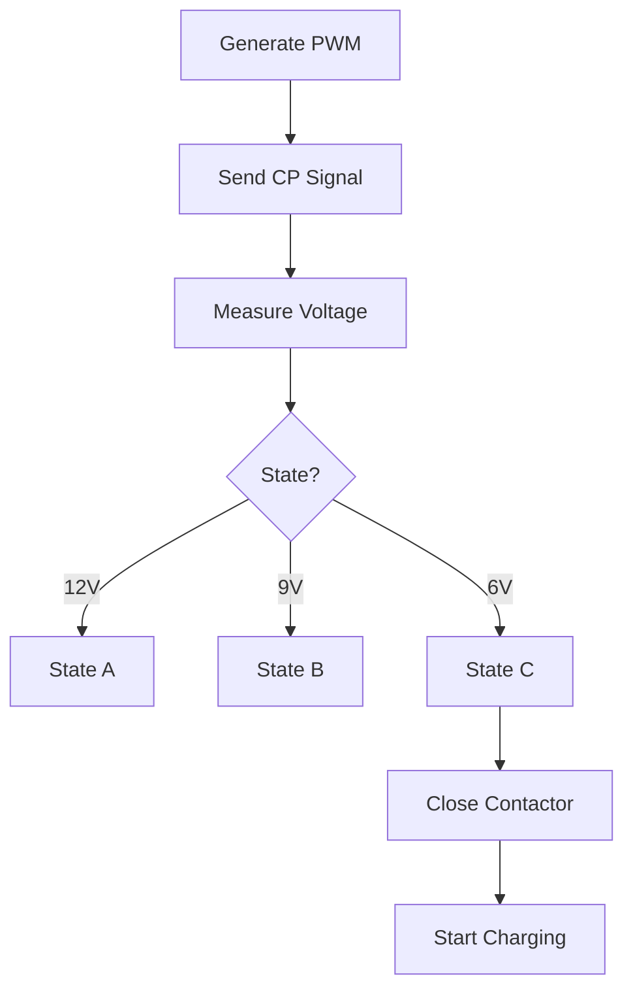
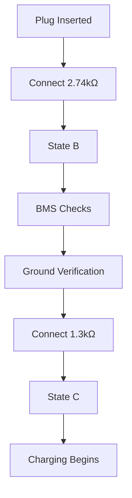

# ⚡ Control Pilot (CP) Communication in EV Charging

> Professional EVSE Engineering Documentation covering IEC 61851 Control Pilot (CP), PWM Signaling, State Detection, Safety Validation, Charging Sequence, and Troubleshooting.

---

## 📑 Table of Contents

1. Introduction
2. CP Architecture
3. Why Control Pilot Exists
4. CP Circuit Components
5. PWM Fundamentals
6. Why ±12V is Used
7. Positive and Negative Half Cycles
8. Diode Verification
9. IEC 61851 State Machine
10. State A
11. State B
12. State C
13. State D
14. Voltage Divider Mathematics
15. PWM Current Advertisement
16. Complete Charging Sequence
17. Internal EVSE Logic
18. Internal EV Logic
19. Fault Detection
20. NOC Troubleshooting Guide
21. Interview Questions
22. References

---

# 1. Introduction

Control Pilot (CP) is the primary communication mechanism between the EV and EVSE.

Before any charging begins, CP communication is used to:

- Detect vehicle presence
- Verify charging readiness
- Advertise maximum available current
- Validate cable integrity
- Verify grounding
- Detect faults
- Control charging start and stop operations

Standards:

- IEC 61851
- SAE J1772

---

# 2. CP Architecture


The charger continuously generates a 1 kHz PWM waveform and sends it to the EV through the CP conductor.

The EV modifies the voltage level using resistor networks connected between CP and PE (Protective Earth).

The charger measures the resulting voltage and determines the charging state.

---

# 3. Why Control Pilot Exists

Without CP:

- Charger cannot detect vehicle
- Charger cannot know charging readiness
- Charger cannot advertise available current
- Charging becomes unsafe

CP is therefore the foundation of safe AC charging.

---

# 4. CP Circuit Components

## EVSE Side

- PWM Generator
- 1 kHz Oscillator
- ±12V Source
- 1 kΩ Reference Resistor (R1)
- ADC Measurement Circuit
- MCU Controller
- Contactor Driver

## EV Side

- Diode
- 2.74 kΩ Resistor (R2)
- 1.3 kΩ Resistor (R3)
- 270 Ω Resistor
- BMS Interface

---

# 5. PWM Fundamentals

PWM = Pulse Width Modulation

The frequency remains fixed at:

```text
1 kHz
```

Only duty cycle changes.

Example:

| Duty Cycle | Meaning |
|------------|----------|
| 10% | Low current available |
| 50% | Medium current available |
| 80% | High current available |

---

# 6. Why ±12V is Used

Many engineers assume CP only uses +12V.

This is incorrect.

IEC 61851 requires:

```text
+12V and -12V
```

The positive half cycle is used for state detection and current advertisement.

The negative half cycle is used for safety validation and diode checking.

---

# 7. Positive and Negative Half Cycles

## Positive Half Cycle

Used for:

- Vehicle detection
- Charging state detection
- PWM current advertisement

## Negative Half Cycle

Used for:

- Diode verification
- Fault detection
- Cable validation

If expected negative response is missing:

```text
Charging Prohibited
```

---

# 8. Diode Verification

The EV contains a diode in the CP path.

```text
CP ---->|---- EV
```

Purpose:

- Verify genuine vehicle connection
- Detect damaged cables
- Detect CP circuit faults

If the diode response is abnormal:

- Charging is blocked
- Fault state is generated

---

# 9. IEC 61851 State Machine

| State | Voltage | Meaning |
|---------|----------|---------|
| A | 12V | No EV Connected |
| B | 9V | EV Connected |
| C | 6V | Ready To Charge |
| D | 3V | Ventilation Required |

---

# 10. State A — No EV Connected

Voltage:

```text
+12V
```

Meaning:

```text
Vehicle Not Connected
```

Charger Action:

```text
Contactor Open
No Power Output
```

---

# 11. State B — EV Connected

Vehicle connects:

```text
R2 = 2.74 kΩ
```

Voltage becomes:

```text
≈ 9V
```

Meaning:

```text
Vehicle Present
Not Ready To Charge
```

Charger keeps contactor open.

---

# 12. State C — Ready To Charge

Vehicle connects:

```text
2.74 kΩ || 1.3 kΩ
```

Voltage becomes:

```text
≈ 6V
```

Meaning:

```text
Vehicle Ready
Charging Allowed
```

Charger closes contactor.

---

# 13. State D — Ventilation Required

Vehicle connects:

```text
2.74 kΩ || 270 Ω
```

Voltage becomes:

```text
≈ 3V
```

Meaning:

```text
Ventilation Required
```

Rare in modern EVs.

---

# 14. Voltage Divider Mathematics

State B calculation:

Formula:

Vcp = Vin × R2 / (R1 + R2)

Where:

```text
Vin = 12V
R1 = 1kΩ
R2 = 2.74kΩ
```

Calculation:

```text
Vcp = 12 × (2.74 / 3.74)

Vcp ≈ 8.8V
```

Rounded:

```text
9V
```

This is how EVSE detects State B.

---

# 15. PWM Current Advertisement

The charger informs the vehicle of available current using PWM duty cycle.

For duty cycles between 10% and 85%:

```text
Imax = Duty Cycle × 0.6
```

Examples:

| Duty Cycle | Current |
|------------|----------|
| 10% | 6A |
| 20% | 12A |
| 30% | 18A |
| 50% | 30A |
| 80% | 48A |
| 85% | 51A |

---

# 16. Complete Charging Sequence

## Step 1

CP = 12V

State A

No vehicle.

## Step 2

Vehicle plugs in.

CP = 9V

State B

Vehicle detected.

## Step 3

Vehicle performs:

- BMS Checks
- Isolation Check
- Ground Verification

Vehicle requests charging.

CP = 6V

State C

## Step 4

EVSE closes contactor.

Power available.

## Step 5

Vehicle reads PWM duty cycle.

Charging starts.

---

# 17. Internal EVSE Logic



---

# 18. Internal EV Logic



---

# 19. Fault Detection

Common CP faults:

| Fault | Description |
|---------|-------------|
| CP Open | Broken wire |
| CP Short to PE | Wiring fault |
| Missing Diode | Vehicle fault |
| Invalid PWM | EVSE fault |
| State Oscillation | Loose connector |

---

# 20. NOC Troubleshooting Guide

| Observation | Possible Cause |
|-------------|----------------|
| CP = 12V | Vehicle not detected |
| CP = 9V | EV not requesting charge |
| CP = 6V but no charging | Contactor issue |
| No negative pulse | Missing diode |
| 9V ↔ 6V oscillation | Loose connector |
| Charging stops randomly | CP interruption |
| Wrong current | PWM mismatch |

---

# 21. Interview Questions

### Why is CP required?

To safely exchange charging state and current capability information.

### What does State B mean?

Vehicle connected but not requesting charging.

### What does State C mean?

Vehicle ready to charge.

### Why use ±12V?

Positive cycle for communication and negative cycle for safety validation.

### What does PWM represent?

Maximum current available from EVSE.

### Why is diode verification important?

To validate cable and vehicle integrity.

---

# 22. References

- IEC 61851
- IEC 62196
- SAE J1772
- ISO 15118
- OCPP 1.6J
- OCPP 2.0.1

---

# 👨‍💻 Author

**Avanish Pandey**

EV Charging Infrastructure | OCPP | EVSE Troubleshooting | NOC Engineering
