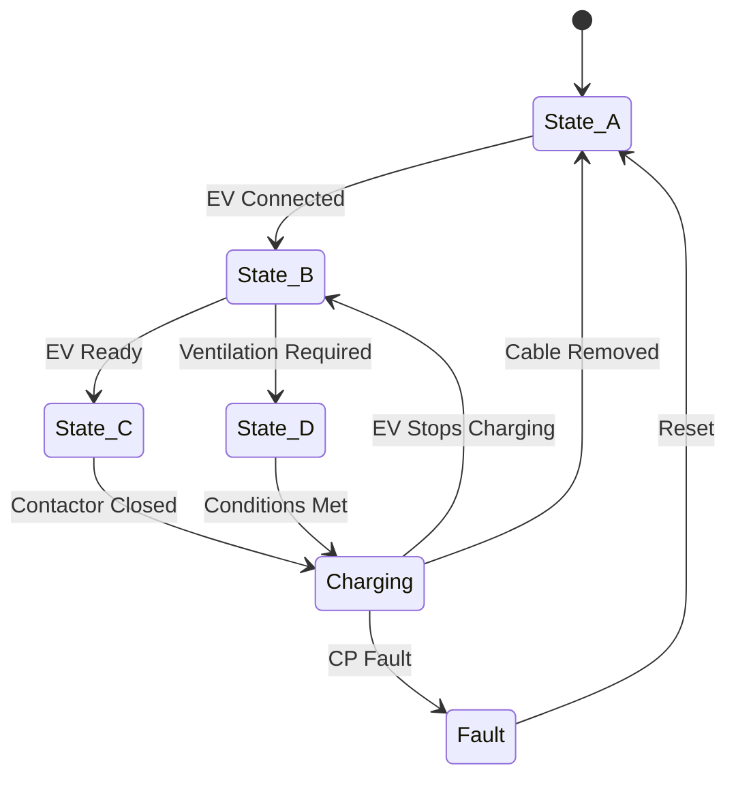
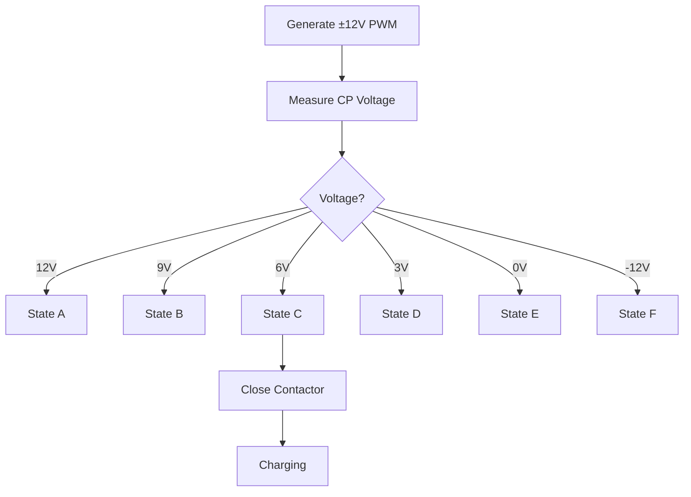

# 🔄 IEC 61851 State Machine

> Understanding EV ↔ EVSE state transitions, Control Pilot voltages, charging authorization, and charging session lifecycle according to IEC 61851.

---

# 📖 Introduction

The IEC 61851 State Machine defines how an Electric Vehicle (EV) and Electric Vehicle Supply Equipment (EVSE) communicate before, during, and after charging.

The charger continuously monitors the Control Pilot (CP) voltage.

Based on the measured voltage, the charger determines the current charging state and decides whether charging is allowed.

---
## 🔄 IEC 61851 State Machine

<p align="center">
  
</p>

---
# 🎯 Why the State Machine Exists

Without a state machine:

- Charger cannot detect vehicle presence
- Charger cannot verify charging readiness
- Charger cannot safely energize output
- Charging becomes unsafe

The IEC 61851 State Machine ensures:

✅ Safe Charging

✅ Vehicle Detection

✅ Charging Authorization

✅ Fault Detection

✅ Safe Disconnect

---

# 🏗️ State Machine Overview



---

# 📊 IEC 61851 States

| State | CP Voltage | Meaning |
|---------|-----------|-----------|
| A | +12V | No EV Connected |
| B | +9V | EV Connected |
| C | +6V | Ready To Charge |
| D | +3V | Ventilation Required |
| E | 0V | Fault |
| F | -12V | Severe Fault |

---

# 🟢 State A – No Vehicle Connected

## CP Voltage

```text
+12V
```

## Electrical Condition

```text
Open Circuit
```

## Meaning

No vehicle connected.

## EVSE Action

```text
Contactor OPEN
Output OFF
```

----

# 🔵 State B – Vehicle Connected

## CP Voltage

```text
+9V
```

## Electrical Condition

```text
2.74 kΩ Connected
```

## Meaning

Vehicle detected.

The EV is connected but has not yet requested charging.

## EVSE Action

```text
Vehicle Present
Wait for Charge Request
```

---

# 🟡 State C – Ready To Charge

## CP Voltage

```text
+6V
```

## Electrical Condition

```text
2.74kΩ || 1.3kΩ
```

## Meaning

Vehicle requests charging.

The EV has completed:

- Ground Check
- Isolation Check
- BMS Validation

## EVSE Action

```text
Close Contactor
Enable Output
Start Charging
```

---

# 🟠 State D – Ventilation Required

## CP Voltage

```text
+3V
```

## Electrical Condition

```text
2.74kΩ || 270Ω
```

## Meaning

Vehicle requires external ventilation.

Historically used for:

- Lead Acid Batteries
- Gas Emitting Batteries

Rare in modern EVs.

---

# 🔴 State E – CP Fault

## CP Voltage

```text
0V
```

## Meaning

Control Pilot fault detected.

Possible causes:

- CP short to PE
- Wiring fault
- Internal EV fault

## EVSE Action

```text
Stop Charging
Open Contactor
Raise Alarm
```

---

# ⚫ State F – Severe Fault

## CP Voltage

```text
-12V
```

## Meaning

Critical CP failure.

Possible causes:

- Missing diode
- Cable damage
- CP hardware fault

## EVSE Action

```text
Immediate Shutdown
Lock Charging Session
Raise Critical Alarm
```

---

# 🔄 Complete Charging Sequence

## Step 1

State A

```text
CP = 12V
```

No vehicle connected.

---

## Step 2

Vehicle plugs in.

State B

```text
CP = 9V
```

Vehicle detected.

---

## Step 3

Vehicle performs:

- Ground Check
- Isolation Check
- BMS Check

---

## Step 4

Vehicle requests charging.

State C

```text
CP = 6V
```

---

## Step 5

EVSE closes contactor.

```text
Charging Starts
```

---

## Step 6

PWM duty cycle advertises current.

Example:

```text
50% Duty Cycle
```

Vehicle interprets:

```text
30A Available
```

---

## Step 7

Charging continues.

EVSE continuously monitors CP voltage.

---

## Step 8

Vehicle stops charging.

State returns:

```text
6V → 9V
```

---

## Step 9

Cable removed.

State returns:

```text
9V → 12V
```

Charging session ends.

---

# 🧠 Internal EVSE Logic



---

# 🚨 NOC Troubleshooting Guide

| Observation | Possible Cause |
|------------|----------------|
| CP stuck at 12V | EV not detected |
| CP stuck at 9V | EV not requesting charging |
| CP stuck at 6V | Contactor issue |
| CP oscillates 9V ↔ 6V | Loose connector |
| CP = 0V | CP short circuit |
| CP = -12V | Diode failure |
| State C but no charging | Power stage failure |

---

# 💼 Interview Questions

### What is State A?

No vehicle connected.

---

### What is State B?

Vehicle connected but not ready to charge.

---

### What is State C?

Vehicle ready to charge.

---

### What is State D?

Ventilation required.

---

### What happens when CP changes from 6V to 9V?

Vehicle stops charging request and EVSE opens the contactor.

---

### Why does EVSE continuously monitor CP?

To detect faults, unplug events, and charging state changes.

---

# 🎯 Key Takeaways

✅ State A = No EV

✅ State B = EV Connected

✅ State C = Charging Allowed

✅ State D = Ventilation Required

✅ State E = Fault

✅ State F = Severe Fault

✅ Charging is only permitted in State C

✅ EVSE continuously monitors CP during charging

---

# 📚 References

- IEC 61851
- IEC 62196
- SAE J1772
- ISO 15118
- OCPP 1.6J
- OCPP 2.0.1

---

# 👨‍💻 Author

**Avanish Pandey**

EV Charging Infrastructure | OCPP | EVSE Troubleshooting | NOC Engineering
