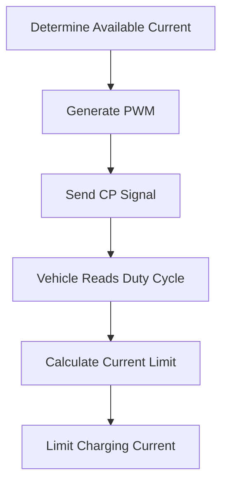

# 📢 PWM Current Advertisement in EV Charging

> Deep Dive into IEC 61851 PWM Signaling, Current Advertisement Logic, Duty Cycle Calculation, EV Current Limitation, and Real-World EVSE Operation.

---

## 📊 PWM Current Advertisement Architecture
<p align="center">
  
</p>
---

# 📖 Introduction

One of the most important functions of the **Control Pilot (CP)** line is **Current Advertisement**.

The EVSE continuously generates a **1 kHz PWM (Pulse Width Modulation)** signal and sends it to the EV over the Control Pilot wire.

The EV measures the PWM duty cycle and determines:

* Maximum current available from the charger
* Whether charging is allowed
* Dynamic current changes during charging

This mechanism is defined in:

* IEC 61851
* SAE J1772

---

# 🎯 Why PWM Current Advertisement Exists

Consider:

| Device  | Capability |
| ------- | ---------- |
| EV      | 32A        |
| Charger | 16A        |

Without current advertisement:

```text
Vehicle may attempt 32A
```

Result:

* Breaker trip
* Charger overload
* Cable overheating
* Charging failure

PWM solves this problem by informing the EV exactly how much current is available.

---

# 🏗️ PWM Communication Architecture

```text
          EVSE
 ┌────────────────────┐
 │ PWM Generator      │
 │ 1 kHz Oscillator   │
 │ ±12V Signal        │
 └─────────┬──────────┘
           │
           │ CP
           │
 ┌─────────▼──────────┐
 │        EV          │
 │ Duty Cycle Reader  │
 │ Current Calculator │
 └────────────────────┘
```

---

# ⚡ What is PWM?

PWM stands for:

```text
Pulse Width Modulation
```

The frequency remains constant.

Only the ON time changes.

---

## Example: 25% Duty Cycle

```text
+12V ┌───┐
     │   │
     │   │
0V ──┘   └────────────
```

ON = 25%

OFF = 75%

---

## Example: 50% Duty Cycle

```text
+12V ┌───────┐
     │       │
     │       │
0V ──┘       └────────
```

ON = 50%

OFF = 50%

---

## Example: 80% Duty Cycle

```text
+12V ┌───────────────┐
     │               │
     │               │
0V ──┘               └─
```

ON = 80%

OFF = 20%

---

# 🔄 Why IEC 61851 Uses 1 kHz

Standard Frequency:

```text
1000 Hz
```

Meaning:

```text
1000 cycles per second
```

Benefits:

* Fast communication
* Noise immunity
* Easy MCU implementation
* Reliable measurement

---

# 📏 Duty Cycle Definition

Duty Cycle = Percentage of time the signal remains HIGH during one cycle.

Formula:

```text
Duty Cycle (%) =
(ON Time / Total Period) × 100
```

Example:

```text
ON Time = 500 µs
Period  = 1000 µs
```

Result:

```text
Duty Cycle = 50%
```

---

# 🚗 How the EV Calculates Current

The EV continuously measures:

* Frequency
* Positive voltage
* Negative voltage
* Duty cycle

Example:

```text
Frequency = 1000 Hz
Duty Cycle = 50%
```

Vehicle determines:

```text
Available Current = 30A
```

---

# 📐 IEC 61851 Current Formula

For duty cycles between:

```text
10% to 85%
```

Current is calculated as:

```text
Current (A) = Duty Cycle × 0.6
```

---

# 📊 Common Duty Cycles

| Duty Cycle | Available Current |
| ---------- | ----------------- |
| 10%        | 6A                |
| 16%        | 9.6A              |
| 20%        | 12A               |
| 25%        | 15A               |
| 30%        | 18A               |
| 40%        | 24A               |
| 50%        | 30A               |
| 60%        | 36A               |
| 70%        | 42A               |
| 80%        | 48A               |
| 85%        | 51A               |

---

# 🔍 Calculation Examples

## Example 1

```text
Duty Cycle = 20%
```

Calculation:

```text
20 × 0.6 = 12A
```

Result:

```text
12A Available
```

---

## Example 2

```text
Duty Cycle = 50%
```

Calculation:

```text
50 × 0.6 = 30A
```

Result:

```text
30A Available
```

---

## Example 3

```text
Duty Cycle = 80%
```

Calculation:

```text
80 × 0.6 = 48A
```

Result:

```text
48A Available
```

---

# ⚡ Does the EV Always Draw the Advertised Current?

No.

The EV selects the lowest value among:

```text
MIN(
Vehicle Capability,
Battery Requirement,
Cable Rating,
Advertised Current
)
```

---

## Example

| Parameter             | Value |
| --------------------- | ----- |
| EV Capability         | 16A   |
| Cable Rating          | 20A   |
| Charger Advertisement | 32A   |

Result:

```text
Charging Current = 16A
```

Because:

```text
MIN(16,20,32)

= 16A
```

---

# 🔄 Dynamic Current Advertisement

Smart chargers can change PWM while charging.

Example:

### Initial

```text
PWM = 50%
```

Vehicle receives:

```text
30A Available
```

### Building Load Increases

Charger changes PWM:

```text
PWM = 25%
```

Vehicle recalculates:

```text
15A Available
```

Charging current automatically reduces.

---

# 🏢 Load Management Example

Building Limit:

```text
100A
```

Current Building Usage:

```text
90A
```

Available Capacity:

```text
10A
```

EVSE updates PWM accordingly.

The EV reduces charging current without stopping the session.

---

# 🔒 Safety Benefits

PWM current advertisement prevents:

✅ Charger overload

✅ Cable overheating

✅ Breaker trips

✅ Building overload

✅ Unsafe charging conditions

---

# 🧠 EVSE Internal Logic



---

# 🚨 NOC Troubleshooting Guide

| Observation                 | Possible Cause          |
| --------------------------- | ----------------------- |
| Charging slow               | Low PWM duty cycle      |
| Current lower than expected | Load balancing active   |
| No charging                 | PWM missing             |
| Current fluctuates          | Dynamic current control |
| Wrong charging current      | Configuration issue     |
| EV ignores limit            | Vehicle-side fault      |

---

# 💼 Interview Questions

### What does PWM advertise?

The maximum current available from the EVSE.

---

### What is the PWM frequency?

```text
1 kHz
```

---

### What does 50% duty cycle indicate?

```text
30A Available
```

---

### Can PWM change during charging?

Yes.

Smart chargers dynamically adjust PWM according to system conditions.

---

### Why is PWM used?

To safely communicate available charging current from EVSE to EV.

---

# 🎯 Key Takeaways

✅ PWM travels on the Control Pilot line.

✅ Frequency remains fixed at 1 kHz.

✅ Duty cycle advertises available current.

✅ EV continuously monitors PWM.

✅ Smart chargers can modify PWM dynamically.

✅ PWM protects chargers, cables, and electrical infrastructure.

---

# 📚 References

* IEC 61851
* IEC 62196
* SAE J1772
* ISO 15118
* OCPP 1.6J
* OCPP 2.0.1

---

# 👨‍💻 Author

**Avanish Pandey**

EV Charging Infrastructure | OCPP | EVSE Troubleshooting | NOC Engineering
