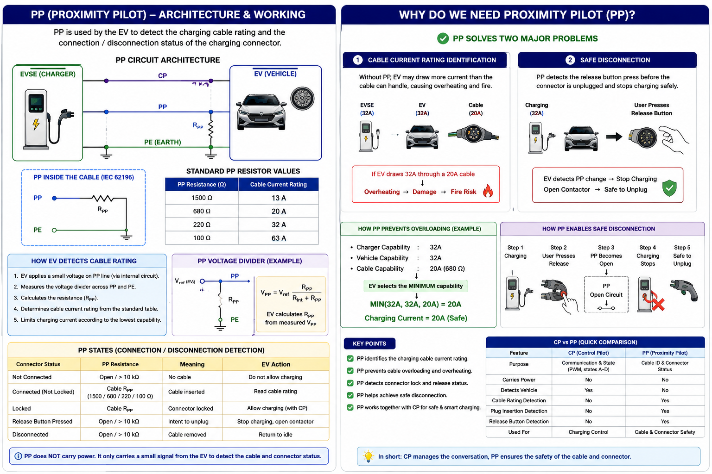
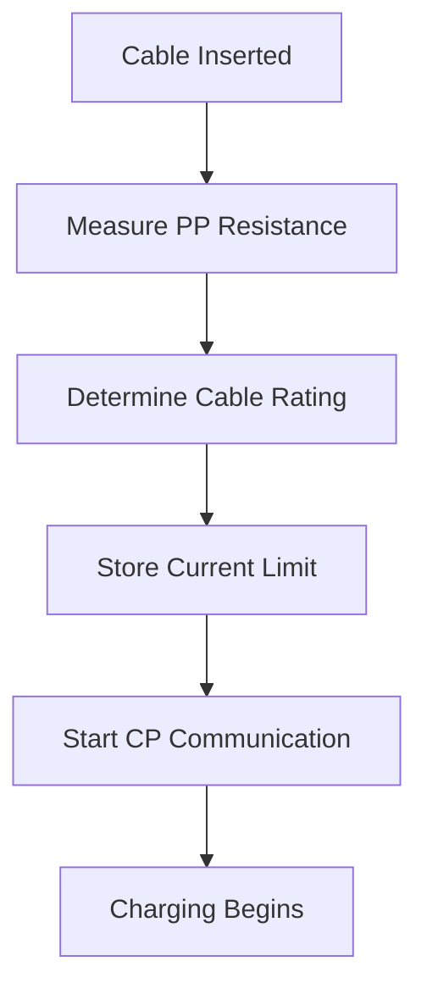
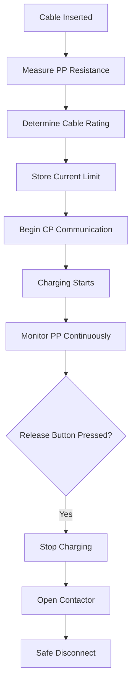

# 🔌 Proximity Pilot (PP) Communication in EV Charging

> Professional EVSE Engineering Documentation covering IEC 61851 / IEC 62196 Proximity Pilot (PP), Cable Detection, Current Rating Identification, Plug Locking, and Troubleshooting.

---

# 📖 Introduction

The **Proximity Pilot (PP)** is a dedicated signal used between the EV charging connector and the EV.

Unlike the Control Pilot (CP), the PP line:

- Does not use PWM communication
- Does not control charging states
- Does not communicate charger readiness

Instead, PP is used for:

- Cable detection
- Connector insertion detection
- Cable current rating identification
- Safe unplug prevention

---
<p align="center">
  
</p>

# 🏗️ PP Architecture

```text
EVSE                     EV

PP -------------------- PP

PE -------------------- PE
```

The PP circuit is implemented using resistor networks inside the charging connector.

---

# 🎯 Why Proximity Pilot Exists

Without PP:

- EV cannot identify cable current rating
- EV cannot detect connector removal
- Charging could exceed cable limits
- Unsafe unplugging could occur

---

# ⚙️ PP Circuit Components

## Inside Charging Connector

- PP Resistor
- Mechanical Latch Switch
- Cable Assembly

## Inside EV

- Voltage Measurement Circuit
- ADC Input
- Charging Controller

---

# 🔍 How PP Works

The charging cable contains a resistor connected between:

```text
PP
 |
Resistor
 |
PE
```

The EV measures the resulting voltage and determines cable capability.

---

# 📊 Standard PP Resistor Values

| Cable Rating | Resistor |
|-------------|----------|
| 13A | 1500 Ω |
| 20A | 680 Ω |
| 32A | 220 Ω |
| 63A | 100 Ω |

---

# 🚗 Cable Identification Process

## Step 1

Connector inserted.

## Step 2

Vehicle measures PP voltage.

## Step 3

Vehicle calculates resistance.

## Step 4

Vehicle determines cable current rating.

Example:

```text
220 Ω
```

Detected as:

```text
32A Cable
```

---

# 🔒 Plug Lock Detection

The connector latch affects PP resistance.

This allows the EV to detect:

- Connector inserted
- Connector locked
- Connector release request
- Connector removed

---

# ⚡ Difference Between CP and PP

| Feature | CP | PP |
|----------|----|----|
| PWM Signal | Yes | No |
| State Detection | Yes | No |
| Current Advertisement | Yes | No |
| Cable Identification | No | Yes |
| Connector Detection | Limited | Yes |
| Safety Unplug Detection | No | Yes |

---

# 🔄 Charging Sequence with PP

## Step 1

Cable inserted.

## Step 2

PP resistance detected.

## Step 3

Cable current rating identified.

## Step 4

CP communication starts.

## Step 5

Charging begins.

---

# 🧠 Internal EV Logic



---

# 🚨 Common PP Faults

| Fault | Description |
|---------|-------------|
| Open Circuit | Broken PP wire |
| Wrong Resistance | Incorrect cable rating |
| Intermittent PP | Connector issue |
| PP Short to PE | Wiring fault |
| Damaged Latch | Plug lock detection failure |

---

# 🔍 NOC Troubleshooting Guide

| Observation | Possible Cause |
|-------------|----------------|
| Cable not detected | PP open circuit |
| Wrong current limit | Incorrect resistor |
| Random charging stop | Intermittent PP |
| Connector unlock fault | Damaged latch |
| Current limited unexpectedly | Wrong cable rating detected |

---

# 🎯 Interview Questions

### What is PP?

A signal used for cable identification and connector detection.

### Does PP use PWM?

No.

### What is the purpose of PP?

To identify cable current capability and detect connector status.

### Which standard defines PP?

IEC 62196 and IEC 61851.

### Difference between CP and PP?

CP handles charging communication, while PP handles cable identification.

---

# 📚 References

- IEC 61851
- IEC 62196
- SAE J1772
- ISO 15118

---
# 🔌 Why Proximity Pilot (PP) Exists in EV Charging

> Understanding the purpose of the Proximity Pilot (PP) signal in IEC 61851 and IEC 62196 charging systems.

---

# 📖 Introduction

Many engineers initially wonder:

> If the Control Pilot (CP) already exists, why do we need a separate Proximity Pilot (PP) signal?

This is one of the most common EVSE interview questions.

The answer is simple:

**Control Pilot (CP) manages charging communication.**

**Proximity Pilot (PP) manages cable identification and connector status.**

Both signals serve completely different purposes.

---

# ⚡ The Problem Without PP

Consider the following charging setup:

### Charger Capability

```text
32A
```

### Vehicle Capability

```text
32A
```

### Charging Cable Capability

```text
20A
```

If PP did not exist, the EV would only know:

```text
Charger = 32A
Vehicle = 32A
```

The EV could attempt to draw:

```text
32A
```

through a cable rated for:

```text
20A
```

Result:

```text
Cable Overheating
```

---

# 🔥 Why Overloading Is Dangerous

Heat generated in a conductor is proportional to:

```text
I²R
```

Where:

* I = Current
* R = Resistance

If current doubles:

```text
Heat = 4x
```

Potential consequences:

* Connector overheating
* Cable insulation damage
* Melted charging plug
* Fire risk
* Charging interruption

---

# 🎯 How PP Solves This Problem

Inside every charging cable is a resistor connected between:

```text
PP
 |
Resistor
 |
PE
```

The EV measures this resistance and determines the cable's current carrying capacity.

Example:

```text
220 Ω
```

indicates:

```text
32A Cable
```

The EV then limits charging current accordingly.

---

# 📊 Standard PP Resistor Values

| Resistance | Cable Rating |
| ---------- | ------------ |
| 1500 Ω     | 13A          |
| 680 Ω      | 20A          |
| 220 Ω      | 32A          |
| 100 Ω      | 63A          |

---

# ⚙️ Current Limitation Logic

The EV always selects the lowest available current limit.

Formula:

```text
Charging Current

= MIN(
Vehicle Capability,
Charger Capability,
Cable Capability
)
```

---

## Example

Vehicle:

```text
16A
```

Charger:

```text
32A
```

Cable:

```text
20A
```

Result:

```text
MIN(16,32,20)

= 16A
```

Charging current becomes:

```text
16A
```

---

# 🔒 Connector Release Detection

PP has another critical responsibility.

It helps detect:

* Connector insertion
* Connector locking
* Release button press
* Connector removal

---

# Example Scenario

While charging:

```text
230V
32A
```

The user presses the release button.

The PP resistance changes immediately.

The EV detects:

```text
Disconnect Request
```

and performs:

```text
Stop Charging
Open Contactor
Disable Power
```

before the connector is removed.

---

# ⚠️ What If PP Didn't Exist?

Imagine unplugging a connector while:

```text
230V
32A
```

is still flowing.

Possible result:

```text
Electrical Arc
```

Consequences:

* Damaged contacts
* Burn marks
* Welded pins
* Fire hazard
* User safety risk

PP helps prevent this situation.

---

# 🔄 PP Operating Sequence



---

# ⚡ CP vs PP

| Feature                      | Control Pilot (CP) | Proximity Pilot (PP) |
| ---------------------------- | ------------------ | -------------------- |
| Vehicle Detection            | ✅                  | ❌                    |
| Charging State Communication | ✅                  | ❌                    |
| PWM Signaling                | ✅                  | ❌                    |
| Current Advertisement        | ✅                  | ❌                    |
| Cable Identification         | ❌                  | ✅                    |
| Plug Detection               | ❌                  | ✅                    |
| Release Detection            | ❌                  | ✅                    |
| Safe Disconnect Support      | ❌                  | ✅                    |

---

# 🎯 Key Takeaways

✅ CP and PP serve different purposes.

✅ CP manages charging communication.

✅ PP identifies cable current rating.

✅ PP prevents cable overloading.

✅ PP detects connector release requests.

✅ PP enables safe disconnection.

✅ PP helps prevent electrical arcing during unplugging.

---

# 💼 Interview Question

### Why is Proximity Pilot (PP) required in EV charging?

**Answer:**

The Proximity Pilot (PP) is used to identify the charging cable's current carrying capacity and detect connector insertion or removal events. It prevents cable overloading by informing the vehicle of the cable rating and supports safe disconnection by detecting release requests before the connector is unplugged. Unlike the Control Pilot (CP), which manages charging communication, PP is dedicated to cable identification and connector status detection.

---

# 📚 References

* IEC 61851
* IEC 62196
* SAE J1772
* ISO 15118

---

# 👨‍💻 Author

**Avanish Pandey**

EV Charging Infrastructure | OCPP | EVSE Troubleshooting | NOC Engineering


