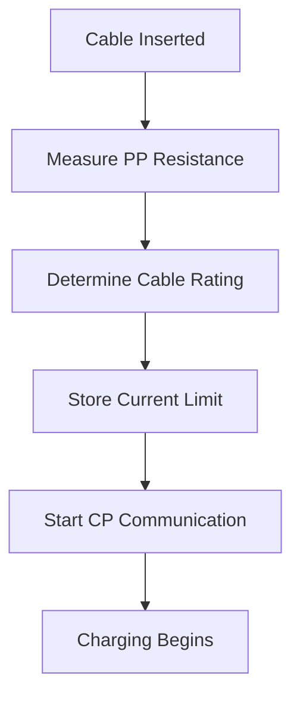

# 🔌 Proximity Pilot (PP) Communication in EV Charging

> Professional EVSE Engineering Documentation covering IEC 61851 / IEC 62196 Proximity Pilot (PP), Cable Detection, Current Rating Identification, Plug Locking, and Troubleshooting.

---

# 📖 Introduction

The **Proximity Pilot (PP)** is a dedicated signal used between the EV charging connector and the EV.

Unlike the Control Pilot (CP), the PP line:

- Does not use PWM communication
- Does not control charging states
- Does not communicate charger readiness

Instead, PP is used for:

- Cable detection
- Connector insertion detection
- Cable current rating identification
- Safe unplug prevention

---

# 🏗️ PP Architecture

```text
EVSE                     EV

PP -------------------- PP

PE -------------------- PE
```

The PP circuit is implemented using resistor networks inside the charging connector.

---

# 🎯 Why Proximity Pilot Exists

Without PP:

- EV cannot identify cable current rating
- EV cannot detect connector removal
- Charging could exceed cable limits
- Unsafe unplugging could occur

---

# ⚙️ PP Circuit Components

## Inside Charging Connector

- PP Resistor
- Mechanical Latch Switch
- Cable Assembly

## Inside EV

- Voltage Measurement Circuit
- ADC Input
- Charging Controller

---

# 🔍 How PP Works

The charging cable contains a resistor connected between:

```text
PP
 |
Resistor
 |
PE
```

The EV measures the resulting voltage and determines cable capability.

---

# 📊 Standard PP Resistor Values

| Cable Rating | Resistor |
|-------------|----------|
| 13A | 1500 Ω |
| 20A | 680 Ω |
| 32A | 220 Ω |
| 63A | 100 Ω |

---

# 🚗 Cable Identification Process

## Step 1

Connector inserted.

## Step 2

Vehicle measures PP voltage.

## Step 3

Vehicle calculates resistance.

## Step 4

Vehicle determines cable current rating.

Example:

```text
220 Ω
```

Detected as:

```text
32A Cable
```

---

# 🔒 Plug Lock Detection

The connector latch affects PP resistance.

This allows the EV to detect:

- Connector inserted
- Connector locked
- Connector release request
- Connector removed

---

# ⚡ Difference Between CP and PP

| Feature | CP | PP |
|----------|----|----|
| PWM Signal | Yes | No |
| State Detection | Yes | No |
| Current Advertisement | Yes | No |
| Cable Identification | No | Yes |
| Connector Detection | Limited | Yes |
| Safety Unplug Detection | No | Yes |

---

# 🔄 Charging Sequence with PP

## Step 1

Cable inserted.

## Step 2

PP resistance detected.

## Step 3

Cable current rating identified.

## Step 4

CP communication starts.

## Step 5

Charging begins.

---

# 🧠 Internal EV Logic



---

# 🚨 Common PP Faults

| Fault | Description |
|---------|-------------|
| Open Circuit | Broken PP wire |
| Wrong Resistance | Incorrect cable rating |
| Intermittent PP | Connector issue |
| PP Short to PE | Wiring fault |
| Damaged Latch | Plug lock detection failure |

---

# 🔍 NOC Troubleshooting Guide

| Observation | Possible Cause |
|-------------|----------------|
| Cable not detected | PP open circuit |
| Wrong current limit | Incorrect resistor |
| Random charging stop | Intermittent PP |
| Connector unlock fault | Damaged latch |
| Current limited unexpectedly | Wrong cable rating detected |

---

# 🎯 Interview Questions

### What is PP?

A signal used for cable identification and connector detection.

### Does PP use PWM?

No.

### What is the purpose of PP?

To identify cable current capability and detect connector status.

### Which standard defines PP?

IEC 62196 and IEC 61851.

### Difference between CP and PP?

CP handles charging communication, while PP handles cable identification.

---

# 📚 References

- IEC 61851
- IEC 62196
- SAE J1772
- ISO 15118

---

# 👨‍💻 Author

**Avanish Pandey**

EV Charging Infrastructure | OCPP | EVSE Troubleshooting | NOC Engineering
